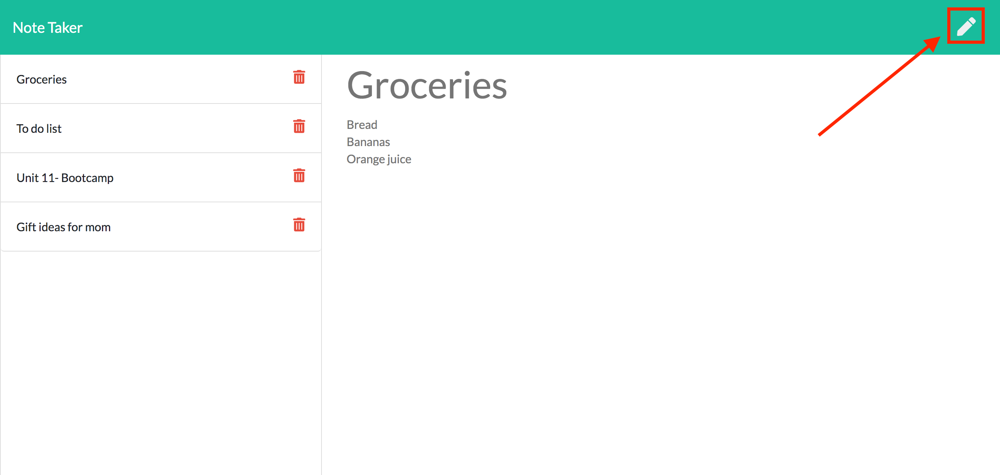
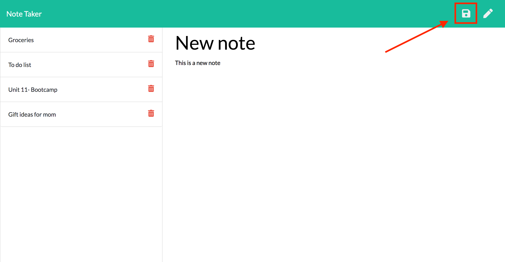
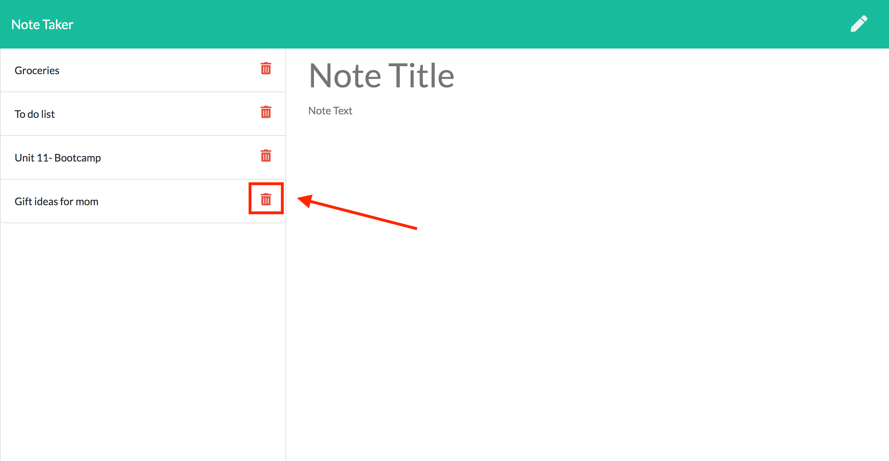

# Note Taker

## Description
[Note Taker](https://sheltered-savannah-52786.herokuapp.com/) is an application that allows users to save and delete notes as desired. This is a useful application for any user looking to store information quickly and easily, from saving work information to saving personal information such as a grocery list. Note Taker utilizes several key technologies:

* Node.JS
* A Heroku server
* HTML and API routes
* Express
* JSON
* fs
* Path 
* UUID

View the deployed application here: https://sheltered-savannah-52786.herokuapp.com/

## Note Taker

## Table of Contents
* [Installation](#installation)
* [Usage](#usage)
* [Credits](#credits)
* [License](#license)
* [Tests](#tests)

## Installation
1. Go to the [GitHub repository for Note Taker](https://github.com/jeanarose/note-taker).
2. Click the green **Code** button.
3. Copy the SSH key.
4. In your terminal, go into the directory that you want to host Note Taker. 
5. Use the command **git clone [insert SSH key URL]** and click **Enter** (*Requires Git*).

## Usage
1. To add a new note, simply start typing in the **Note Title** and **Note Text** fields, or click the pencil icon in the top right corner if you are currently viewing a note.

2. Once you have written a note that you'd like to save, click the save button in the top right corner. *Note: You must input in Note Title **and** Note Text in order for the save button to appear.* 

3. If you wish to delete a note, simply click the trash can icon next to the note that you'd like to delete.

## Credits
The following people contributed to the success of this application. You can view their GitHub profiles by clicking on their names:
* [Jonathan Watson](https://github.com/jonathanjwatson)
* [Peter Colella](https://github.com/petercolella)

The following sites were used to find code to make Weather Dashboard function properly:
* [Express:](https://expressjs.com/en/starter/static-files.html) Serving up static files in Express
* [Stack Overflow:](https://stackoverflow.com/questions/50023291/add-id-to-array-of-objects-javascript) Add ID to object in array

## License
Copyright (c) 2021 Jeana Rose Mathis

MIT License
    
Permission is hereby granted, free of charge, to any person obtaining a copy
of this software and associated documentation files (the "Software"), to deal
in the Software without restriction, including without limitation the rights
to use, copy, modify, merge, publish, distribute, sublicense, and/or sell
copies of the Software, and to permit persons to whom the Software is
furnished to do so, subject to the following conditions:
    
The above copyright notice and this permission notice shall be included in all
copies or substantial portions of the Software.
    
THE SOFTWARE IS PROVIDED "AS IS", WITHOUT WARRANTY OF ANY KIND, EXPRESS OR
IMPLIED, INCLUDING BUT NOT LIMITED TO THE WARRANTIES OF MERCHANTABILITY,
FITNESS FOR A PARTICULAR PURPOSE AND NONINFRINGEMENT. IN NO EVENT SHALL THE
AUTHORS OR COPYRIGHT HOLDERS BE LIABLE FOR ANY CLAIM, DAMAGES OR OTHER
LIABILITY, WHETHER IN AN ACTION OF CONTRACT, TORT OR OTHERWISE, ARISING FROM,
OUT OF OR IN CONNECTION WITH THE SOFTWARE OR THE USE OR OTHER DEALINGS IN THE
SOFTWARE. 
## Tests
Interested in testing Note Taker?
1. When you input text into both the Note Title and Note Text fields, the save button appears in the top right corner.
2. Ensure that you can save a new note and that the note title is added to the side dock after the click of the save button. 
3. Save at least one note, then refresh the page to ensure that the note persisted after a refresh.
4. When you click the trash icon, the corresponding note is removed from the dock and does not reappear after a page refresh. 

## Questions
If you have any questions, you can contact me at jr.mathis608@gmail.com. 
You can also view my GitHub profile at https://github.com/jeanarose.
  